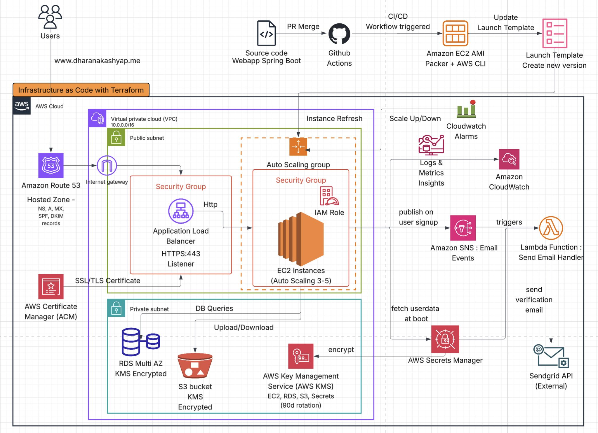

# Email Verification Serverless Function

AWS Lambda function for handling email verification requests. Processes SNS events, sends verification emails via SES, and stores records in DynamoDB for duplicate prevention.

## Architecture

## Prerequisites

- **Python 3.12+**
- **Docker** - for building and testing the Lambda container
- **AWS CLI** - configured with appropriate credentials
- **AWS Credentials** - for dev and demo accounts with access to:
  - ECR (Elastic Container Registry)
  - Lambda
  - DynamoDB
  - SES (Simple Email Service)
- **Git** - for version control

## Related Repositories

- [webapp](https://github.com/dany-sigha-csye6225/webapp) - Main web application
- [tf-infra](https://github.com/dany-sigha-csye6225/tf-infra) - Terraform infrastructure as code for AWS adn GCP deployment

## Getting Started

For detailed setup instructions, build steps, testing, deployment, and configuration, see [GETTING_STARTED.md](GETTING_STARTED.md).
